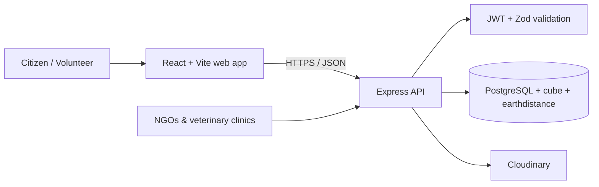
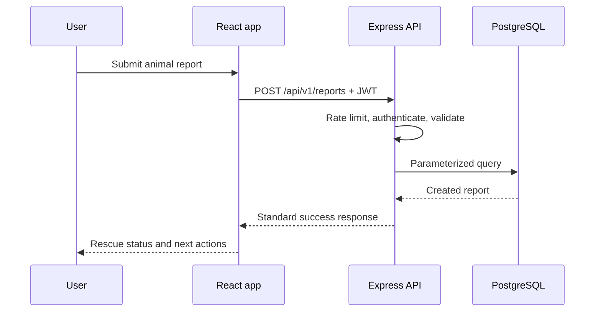

<div align="center">

# 🐾 Sevana

### Community-Driven Animal Rescue Platform


Connecting citizens, volunteers, NGOs, and veterinary clinics to rescue animals faster and more efficiently.

> Built with React, Node.js, Express, PostgreSQL, Cloudinary, Zod, and JWT authentication.

[](https://react.dev/)
[](https://nodejs.org/)
[](https://www.postgresql.org/)
[](https://jwt.io/)
[](https://www.docker.com/)
[](LICENSE)
[](docs/roadmap.md)
[](docs/changelog.md)

[Explore features](#-features) · [Run locally](#-getting-started) · [API reference](#-api-overview) · [Documentation](#-documentation)

</div>

---

## About

Every day, injured, abandoned, and lost animals go unnoticed because there is no centralized way for citizens to quickly connect with volunteers, NGOs, and veterinary clinics.

Sevana provides one coordinated rescue platform where the community can report emergencies, find help nearby, join rescue operations, and follow each case through to resolution. Participation is encouraged with XP, achievements, and a community-first volunteer workflow.

## 🔗 Live demo

🚧 **Coming Soon**

Frontend and backend deployment will be available after the first production release.

## ✨ Features

| | Capability | What it enables |
| --- | --- | --- |
| 🔐 | Secure authentication | Register, sign in, and access protected actions with JWTs. |
| 🐕 | Animal rescue reports | Create location-aware reports with severity and animal details. |
| 🙋 | Raise Hand system | Let nearby volunteers signal that they can help. |
| 🏥 | Vet discovery | Find nearby veterinary clinics based on location. |
| 🤝 | NGO directory | Discover animal welfare organizations in the area. |
| 🔎 | Lost & Found | Publish and resolve lost or found animal notices. |
| 🖼️ | Image uploads | Secure JPEG, PNG, and WebP uploads through Cloudinary. |
| 👤 | User profiles | Manage profile data and view rescue-related statistics. |
| ⚡ | XP & achievements | Reward meaningful community participation. |
| 📍 | Geolocation support | Prioritize reports, clinics, NGOs, and alerts close to the user. |

## 🖼️ Screenshots

Real product screenshots for Home, Report Animal, Rescue Feed, Vet Finder, Lost & Found, and Profile will be added after frontend completion.

## 🧰 Tech stack

| Layer | Technology |
| --- | --- |
| Frontend | React 18, Vite, Axios |
| Backend | Node.js, Express |
| Database | PostgreSQL with `cube` and `earthdistance` extensions |
| Authentication | JSON Web Tokens, bcryptjs |
| Validation | Zod |
| Image storage | Cloudinary, Multer |
| Security | Helmet, CORS, request throttling, parameterized SQL |
| API testing | Postman |
| Local services | Docker Compose, PostgreSQL |

## 🏗️ Architecture



### Request flow



## 📁 Project structure

```text
Sevana/
├── sevana-files/                 # React + Vite frontend
│   └── src/
│       ├── Components/
│       ├── Screens/
│       ├── Context/
│       └── api/
├── sevana-backend/               # Express API
│   ├── src/
│   │   ├── controllers/
│   │   ├── middleware/
│   │   ├── routes/
│   │   ├── validators/
│   │   └── services/
│   └── database/migrations/
├── docs/                         # Product and engineering documentation
├── postman/                      # Postman collections and environments
├── assets/                       # Logo and future README visual assets
├── docker-compose.yml            # Local PostgreSQL service configuration
├── README.md
└── LICENSE
```

## 🚀 Getting started

### Prerequisites

- Node.js 18 or later
- npm 9 or later
- Docker Desktop (recommended for local PostgreSQL)
- A Cloudinary account for uploads

### 1. Clone the repository

```bash
git clone https://github.com/chandraprakashmishra18/sevana.git
cd sevana
```

### 2. Start local services

Create a root `.env` for Docker Compose, then start PostgreSQL:

```bash
docker compose up -d postgres
```

### 3. Start the backend

```bash
cd sevana-backend
cp .env.example .env
npm install
npm run migrate
npm run dev
```

The API starts at `http://localhost:5000`.

### 4. Start the frontend

Open a second terminal:

```bash
cd sevana-files
cp .env.example .env
npm install
npm run dev
```

Vite will print the local frontend URL, normally `http://localhost:5173`.

## 🔐 Environment variables

Never commit `.env` files. Start from the example files and use unique, long-lived secrets outside development.

### Backend — `sevana-backend/.env`

| Variable | Required | Description |
| --- | --- | --- |
| `PORT` | No | API port; defaults to `5000`. |
| `NODE_ENV` | Yes | `development`, `test`, or `production`. |
| `DATABASE_URL` | Yes | PostgreSQL connection URL. |
| `JWT_ACCESS_SECRET` | Yes | At least 32 characters; used for short-lived access tokens. |
| `JWT_REFRESH_SECRET` | Yes | At least 32 characters; used for refresh tokens. |
| `CORS_ORIGIN` | Production | Comma-separated allowed frontend origins. |
| `CLOUDINARY_CLOUD_NAME` | Uploads | Cloudinary cloud name. |
| `CLOUDINARY_API_KEY` | Uploads | Cloudinary API key. |
| `CLOUDINARY_API_SECRET` | Uploads | Cloudinary API secret. |

### Docker Compose — root `.env`

```env
POSTGRES_USER=sevana
POSTGRES_PASSWORD=replace-with-a-strong-password
POSTGRES_DB=sevana
POSTGRES_PORT=5432
```

## 🔌 API overview

All API responses use a consistent envelope:

```json
{
  "success": true,
  "message": "Report created successfully.",
  "data": {}
}
```

| Area | Base path | Examples |
| --- | --- | --- |
| Authentication | `/api/v1/auth` | `POST /register`, `POST /login`, `GET /me` |
| Reports | `/api/v1/reports` | Create, list, retrieve, update status, volunteer response |
| Users | `/api/v1/users` | Profile, profile updates, personal statistics |
| Vets & NGOs | `/api/v1/vets`, `/api/v1/ngos` | Nearby directory search and detail views |
| Lost & Found | `/api/v1/lost-found` | Create, list, resolve posts |
| Community alerts | `/api/v1/raise-hand` | Create and search nearby volunteer alerts |
| Donations | `/api/v1/donations` | List, create, retrieve donations |
| Uploads | `/api/v1/uploads` | Authenticated animal-image upload |

See the [API specification](docs/api-spec-v3.md) and [Postman guide](docs/postman-guide.md) for endpoint details, headers, and example requests.

## 📚 Documentation

<details>
<summary><strong>Open the engineering and product documentation</strong></summary>

<br />

- [Documentation index](docs/README.md)
- [Architecture](docs/architecture-v2.md)
- [Database design](docs/database-v2.md)
- [API specification](docs/api-spec-v3.md)
- [Testing guide](docs/testing.md)
- [Deployment guide](docs/deployment-v2.md)
- [Security guidance](docs/security-guidelines.md)
- [Legal information](docs/legal-v2.md)
- [Roadmap](docs/roadmap.md)
- [Contributing guide](docs/contributing.md)

</details>

## 🧪 Testing and quality checks

```bash
# Frontend linting
cd sevana-files
npm run lint

# Frontend production build
npm run build

# Backend syntax smoke check
cd ../sevana-backend
Get-ChildItem src -Recurse -Filter *.js | ForEach-Object { node --check $_.FullName }
```

Use the project’s [Postman guide](docs/postman-guide.md) for API test collections and environment setup.

## 🚢 Deployment

The intended production topology is:

- Frontend: Vercel
- Backend: Render or Railway
- Database: Neon PostgreSQL
- Image storage: Cloudinary

Before deploying, set production-only environment values, configure `CORS_ORIGIN`, rotate any development credentials, and follow the [deployment guide](docs/deployment-v2.md).

## 🗺️ Roadmap

- [x] Authentication and profile management
- [x] Animal report creation and rescue workflow
- [x] Vet and NGO discovery
- [x] Lost & Found notices
- [x] Image upload support
- [x] XP and community participation foundations
- [ ] Notifications and real-time rescue updates
- [ ] Production frontend, backend, and database deployment
- [ ] Mobile experience
- [ ] AI-assisted animal detection
- [ ] Replace README placeholders with product screenshots and brand assets

## 🤝 Contributors

Sevana welcomes thoughtful contributions. Please read the [contributing guide](docs/contributing.md), follow the documented coding standards, and open a focused pull request.

## 📄 License

This project is licensed under the [MIT License](LICENSE).

## 📬 Contact

**Chandra Prakash Mishra**

- GitHub: [@chandraprakashmishra18](https://github.com/chandraprakashmishra18)
- Email: [prashantmishra44140@gmail.com](mailto:prashantmishra44140@gmail.com)

---

<div align="center">
  Built with care for the people who stop to help. 🐾
  <br /><sub>Last updated: July 2026</sub>
</div>
